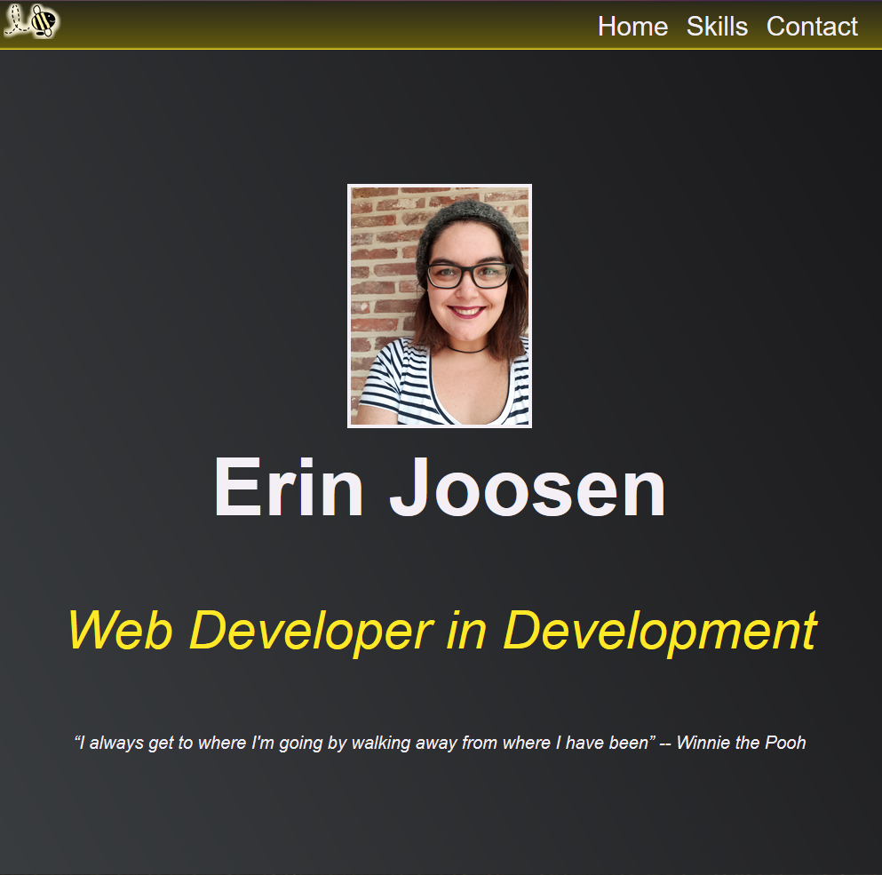

# About Me Project

Made by Erin Joosen

Made for educational purposes

---

# Preview

The About Me webpage can be found <a href="https://calliyope.github.io/index.html"> here</a>
 
 

---

This project aimed to introduce HTML and CSS to beginning web developers. We were instructed to create a site with at least 2 pages that was correctly structured and based on ourselves. While hideous in appearance, I believe I have pretty much nailed this task.  

This repository was made to share my learning with my peers and coaches at BeCode. 

---

# License

All content has been created by me for specific use with this project. 
